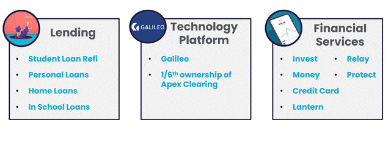
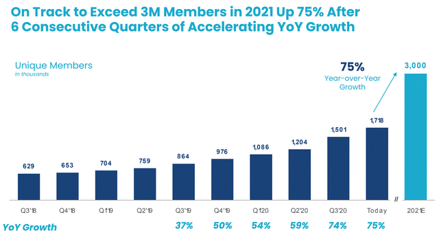

# Sofi

## Overview and Origin

* (((((When was the company incorporated?
* (((Who are the founders of the company?

SoFi was founded in 2011 by Mike Cagney, Dan Macklin, James Finnigan, and Ian Brady, four students who met at the [Stanford Graduate School of Business](https://en.wikipedia.org/wiki/Stanford_Graduate_School_of_Business). The founders hoped SoFi could provide more affordable options for those taking on debt to fund their education. 

The current CEO: Anthony Noto, 50, former Twitter COO

* How did the idea for the company (or project) come about?
 SoFi started with online student loan refinancing and later branched into other services for affluent Millennials, including mortgages, robo-investing advice and life insurance, personal loans, stock and cryptocurrency trading, and wealth management services.

* How is the company funded? How much funding have they received?

   

   The company is going public via Chamath Palihapitiya's SPAC Social Capital Hedosophia Holdings Corp. V. The transaction is expected to deliver up to [$2.4 billion](https://www.businesswire.com/news/home/20210107005746/en/SoFi-A-Leading-Next-Generation-Financial-Services-Platform-to-Become-Publicly-traded-via-Merger-with-Social-Capital-Hedosophia) of gross proceeds to SoFi including a $1.2 billion PIPE placing the company at an equity value of $8.65 billion.

   [Financial past Funding & History](https://en.wikipedia.org/wiki/SoFi#History)

   (((**SoFi, $4.4 billion\***

## Business Activities:

* What specific financial problem is the company or project trying to solve?

## Financial Services Industry Is A Large, Broken Industry And SoFi Can Fix It

The markets that SoFi targets are quite large — representing trillions worth of opportunity. Palihapitiya’s decision to merge with SoFi was based on his conclusion that it was well-positioned to grow.

How so? He said that SoFi could “meet the needs of mobile-first consumers and lower the cost of banking through technology,” according to CNBC. He also thought that SoFi would do in banking what Amazon had done in retail. 

Palihapitiya told CNBC that he “systematically tried to future out what was broken in banking” and concluded that “SoFi was the top of the list when I looked across all the companies” that could deliver the solution that potential customers wanted.

### 💰 ONE-STOP-SHOP 💰

Today, SoFi wants to help its customers with every ***financial step*** of their journey. It has therefore branched out into **[numerous financial activities](https://www.sofi.com/products/)**, providing:

- Student loans
- Medical loans
- Home loans
- Renters insurance (in partnership with Lemonade)
- ETFs
- Stocks & cryptos
- Credit card
- Auto insurance (in partnership with Root)

SoFi (NYSE:[IPOE](https://seekingalpha.com/symbol/IPOE?source=content_type:react|section:main_content|button:body_link" \o "Social Capital Hedosophia Holdings Corp. V)) is a fast-growing American personal finance company that offers a suite of financial products to consumers directly through its [app](https://apps.apple.com/us/app/sofi-invest-and-track-money/id1191985736) and [website](https://www.sofi.com/). 

SoFi has been structured around three operating segments; (1) Lending; (2) Technology platform; and (3) Financial Services. Its lending arm constituted 83% of estimated 2021 fiscal year revenue. This deals with personal, home, and private student loans.

The technology platform constitutes primarily Galileo Financial Technologies, acquired by SoFi for[ $1.2 billion](https://techcrunch.com/2020/04/07/another-major-fintech-exit-as-sofi-acquires-banking-and-payments-platform-galileo-for-1-2b/) in April 2020.  SoFi is positioned to benefit from a broader shift toward digital banking through its Galileo platform, which uses application programming interfaces, or APIs, to let companies build financial services offerings. The APIs enable account setup, funding, direct deposits, money transfers, bill payment and other capabilities.

[Source](https://craft.co/sofi)

SoFi's financial services include its stock trading app and the recently launched [SoFi credit card](https://www.finextra.com/pressarticle/84717/sofi-launches-credit-card) which provides 2% unlimited cash back on all purchases when users redeem into a related SoFi product. This cross-selling of multiple financial products forms a major tenet for SoFi's bull case as it helps to boost revenue while minimising churn. This has been most highlighted in the 220% growth of their multi-product members from 125,000 as at the end of Q4 2019 to 400,000 as at the end of Q4 2020. The company estimates this will rise to 775,000 as at the end of the 2021 fiscal year, a 95% year-over-year increase.

[Source](https://seekingalpha.com/article/4406011-sofi-growing-fintech-company)

**Strong Forward Revenue Visibility And A Path To Positive EBITDA**

SoFi is on track to exceed 3 million members for 2021. This would be a year-over-year increase of 75%, a full 100 basis points more than the 74% increase of its FY 2020 over FY 2019.

* Who is the company's intended customer?  Is there any information about the market size of this set of customers?

  After beginning as a student-loan platform, Social Finance Inc. — better known as SoFi — aims to be a hub for all things personal finance as it heads for the public markets.

  SoFi already provides personal and home loans, investment services, small-business financing and other financial products. The ultimate goal is to get customers to sign up for more than one financial offering, which the company argues helps lower its customer-acquisition costs while creating a more seamless experience for those using the products.

  

  What solution does this company offer that their competitors do not or cannot offer? (What is the unfair advantage they utilize?)

  

> “ no one had really built a financial-services experience on one digital platform and used data to drive great value” 

* Which technologies are they currently using, and how are they implementing them? (This may take a little bit of sleuthing–– you may want to search the company’s engineering blog or use sites like Stackshare to find this information.)

## Landscape:

* What domain of the financial industry is the company in?
* What have been the major trends and innovations of this domain over the last 5-10 years?

* What are the other major companies in this domain?

[Sofi's Competitors](https://craft.co/sofi/competitors)

## Results

* What has been the business impact of this company so far?
* What are some of the core metrics that companies in this domain use to measure success? How is your company performing, based on these metrics?

## Financial Projections Suggest More Growth Ahead

Palihapitiya has high hopes for SoFi’s growth, according to an [SEC filing](https://www.sec.gov/Archives/edgar/data/1818874/000110465921001951/tm211973d1_ex99-3.htm), which trumpets double digit growth expectations and rising cash flow. More specifically,

- **Loan volume up at a 25%** compound annual rate from an estimated $9.6 billion in 2020 to a forecast $42.1 billion in 2025;
- **Adjusted net revenue up at a 43% compound annual rate** from an estimated $621 million in 2020 to a forecast $3.7 billion in 2025; and
- **Improving adjusted earnings before interest, taxes, depreciation and amortization (EBITDA).** From an estimated negative $66 million in 2020 to a forecast of nearly $1.2 billion in 2025.

* How is your company performing relative to competitors in the same domain?

## Recommendations

* If you were to advise the company, what products or services would you suggest they offer? (This could be something that a competitor offers, or use your imagination!)

* Why do you think that offering this product or service would benefit the company?

* What technologies would this additional product or service utilize?

* Why are these technologies appropriate for your solution?