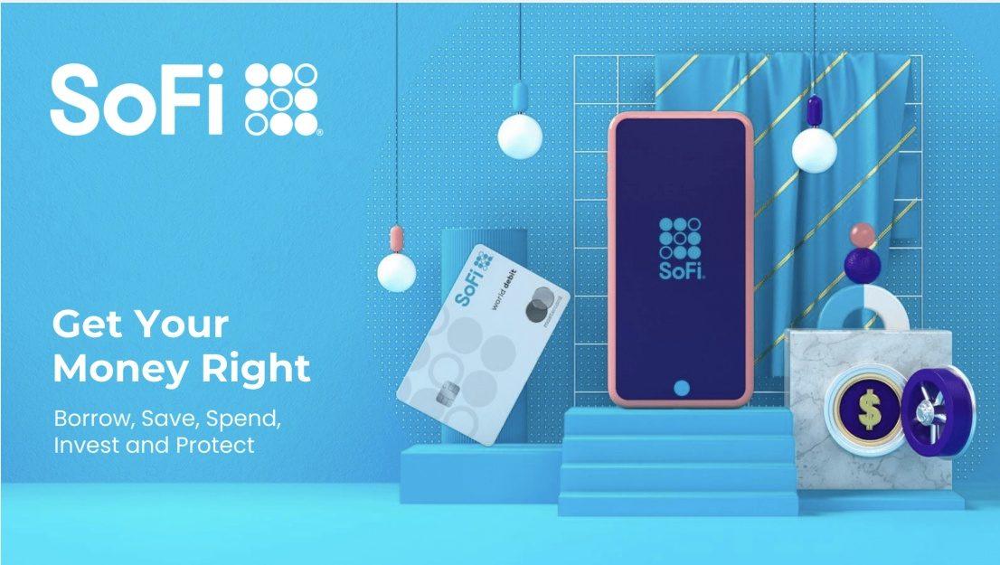
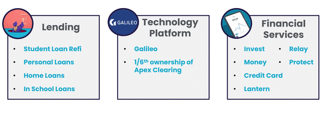
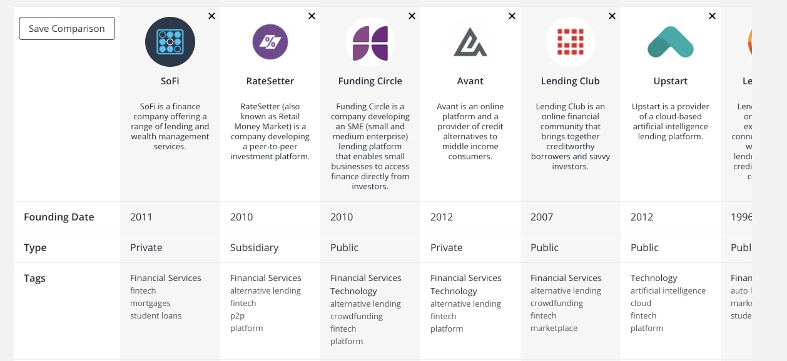

# Sofi

## Overview and Origin

* When was the company incorporated?
* Who are the founders of the company?

SoFi was founded in 2011 by Mike Cagney, Dan Macklin, James Finnigan, and Ian Brady, four students who met at the [Stanford Graduate School of Business](https://en.wikipedia.org/wiki/Stanford_Graduate_School_of_Business). The founders initial pitch was to student debt-laden millennials, some of whom were struggling to find their footing in the economic recovery that followed the Great Recession & hoped SoFi could provide more affordable options for those taking on debt to fund their education. [Reference1](https://en.wikipedia.org/wiki/SoFi) [Reference2](https://www.forbes.com/advisor/investing/sofi-ipo/)  

* How did the idea for the company (or project) come about?

During the crisis of 2008, it was apparent banking was broken. Not only were banks over levered and introducing significant risk to the economy, they had lost touch with their value proposition of serving communities.

 SoFi later branched into other services for affluent Millennials, including mortgages, robo-investing advice and life insurance, personal loans, stock and cryptocurrency trading, and wealth management services.

* How is the company funded? How much funding have they received

  ###### 2011–13

   The company's inaugural loan program was a $2 million pilot at Stanford. For this pilot, 40 alumni invested about $2 million in approximately 100 students, for an average of $20,000 per student.[[1\]](https://en.wikipedia.org/wiki/SoFi#cite_note-auto-1)[[2\]](https://en.wikipedia.org/wiki/SoFi#cite_note-2)[[3\]](https://en.wikipedia.org/wiki/SoFi#cite_note-3)

   In September 2012, SoFi raised $77.2 million, led by [Baseline Ventures](https://en.wikipedia.org/wiki/Baseline_Ventures), with participation from DCM and [Renren](https://en.wikipedia.org/wiki/Renren).[[4\]](https://en.wikipedia.org/wiki/SoFi#cite_note-4)[[5\]](https://en.wikipedia.org/wiki/SoFi#cite_note-5) Additional investors included [Ron Suber](https://en.wikipedia.org/wiki/Ron_Suber).[[6\]](https://en.wikipedia.org/wiki/SoFi#cite_note-6)

   On October 2, 2013, SoFi announced that it had raised $500 million in debt and equity to fund and refinance student loans. This total funding amount came from $90 million in equity, $151 million in debt, and $200 million in bank participations, with the remaining capital from alumni and community investors.[[7\]](https://en.wikipedia.org/wiki/SoFi#cite_note-7) The $151 million in debt includes a $60 million line of credit from Morgan Stanley, and a $41 million line of credit from Bancorp.[[8\]](https://en.wikipedia.org/wiki/SoFi#cite_note-8)[[9\]](https://en.wikipedia.org/wiki/SoFi#cite_note-9)[[10\]](https://en.wikipedia.org/wiki/SoFi#cite_note-10)
  
   As of September 2013, SoFi had funded $200 million in loans to 2500 borrowers at the company's 100 eligible schools.[[11\]](https://en.wikipedia.org/wiki/SoFi#cite_note-11)
  
   In November 2013, SoFi announced a deal with [Barclays](https://en.wikipedia.org/wiki/Barclays) and [Morgan Stanley](https://en.wikipedia.org/wiki/Morgan_Stanley) to create a bond backed by [peer-to-peer](https://en.wikipedia.org/wiki/Peer-to-peer_lending) student loans, and this would create the first [securitization](https://en.wikipedia.org/wiki/Securitization) of these loans to receive a [credit rating](https://en.wikipedia.org/wiki/Credit_rating).[[12\]](https://en.wikipedia.org/wiki/SoFi#cite_note-12)
  
   ###### 2014–18
  
   In April 2014, SoFi raised $80 million in a [Series C](https://en.wikipedia.org/wiki/Series_C) round led by Discovery Capital Management with participation from [Peter Thiel](https://en.wikipedia.org/wiki/Peter_Thiel), Wicklow Capital, and existing investors. Money was raised to expand the footprint of the company's student loan refinancing business and to extend into new products like mortgages and personal loans.[[13\]](https://en.wikipedia.org/wiki/SoFi#cite_note-13)
  
   In February 2015, the company announced a $200 million funding round led by [Third Point Management](https://en.wikipedia.org/wiki/Third_Point_Management). That same month, the company officially began offering personal loans.[[14\]](https://en.wikipedia.org/wiki/SoFi#cite_note-14)[[15\]](https://en.wikipedia.org/wiki/SoFi#cite_note-15) By March 2015, the company was offering mortgages in more than 20 states, up from its initial launch that included under ten states in October, 2014.[[16\]](https://en.wikipedia.org/wiki/SoFi#cite_note-16)[[17\]](https://en.wikipedia.org/wiki/SoFi#cite_note-17) By April 2015, the company had funded more than $2 billion in loans, including student loan refinancing, mortgages, personal loans and MBA loans. To celebrate its $2 billion milestone, SoFi announced a contest, #2BillionTogether, to pay off one of its members student loans.[[18\]](https://en.wikipedia.org/wiki/SoFi#cite_note-18) In September 2015, Former SEC Chairman Arthur Levitt was added as an advisor. The firm also raised a $1 billion round of investment from [SoftBank](https://en.wikipedia.org/wiki/SoftBank)[[19\]](https://en.wikipedia.org/wiki/SoFi#cite_note-19) and said it had funded $4 billion in loans.[[20\]](https://en.wikipedia.org/wiki/SoFi#cite_note-20)
  
   In May 2016, SoFi became the first startup online lender to receive a triple-A rating from [Moody's](https://en.wikipedia.org/wiki/Moody's_Investors_Service).[[21\]](https://en.wikipedia.org/wiki/SoFi#cite_note-21) In September 2016, SoFi launched SoFi at Work, an employee benefit program to reduce student debt and build financial wellness, and announced it has more than 600 corporate partners.[[22\]](https://en.wikipedia.org/wiki/SoFi#cite_note-22) As of October 2016, SoFi has funded more than $12 billion in total loan volume and has 175,000 members.[[23\]](https://en.wikipedia.org/wiki/SoFi#cite_note-23) In February 2017, it was announced that Social Finance Inc. raised an additional $500 million from an investor group led by [Silver Lake](https://en.wikipedia.org/wiki/Silver_Lake_Partners), and also including SoftBank, to help support global expansion.[[24\]](https://en.wikipedia.org/wiki/SoFi#cite_note-Rudegeair-24)[[25\]](https://en.wikipedia.org/wiki/SoFi#cite_note-25)
  
   On September 11, 2017, Chief Executive Mike Cagney announced he would resign by the end of year due to allegations of sexual harassment and skirting risk and compliance controls.[[26\]](https://en.wikipedia.org/wiki/SoFi#cite_note-26) Announced January 23, 2018, [Anthony Noto](https://en.wikipedia.org/wiki/Anthony_Noto) resigned from his position as COO of [Twitter](https://en.wikipedia.org/wiki/Twitter), to become the CEO of Social Finance.[[27\]](https://en.wikipedia.org/wiki/SoFi#cite_note-wsj-spot-27)[[28\]](https://en.wikipedia.org/wiki/SoFi#cite_note-28) In April 2018, SoFi announced that Michelle Gil, who previously worked at [TPG](https://en.wikipedia.org/wiki/TPG_Capital) and [Goldman Sachs](https://en.wikipedia.org/wiki/Goldman_Sachs), was joining the company as Chief Financial Officer.[[29\]](https://en.wikipedia.org/wiki/SoFi#cite_note-29)
  
   In October 2018, SoFi settled [FTC](https://en.wikipedia.org/wiki/Federal_Trade_Commission) charges, agreeing to stop making false claims about savings from student loan refinancing. The FTC alleged that SoFi had been making such false claims since April 2016.[[30\]](https://en.wikipedia.org/wiki/SoFi#cite_note-30) In February 2019, the FTC announced its approval of the final consent order under which SoFI is prohibited from misrepresenting to consumers how much money consumers will save or have saved using its products and from making any claims about any such savings unless the claims are backed up with reliable evidence.[[31\]](https://en.wikipedia.org/wiki/SoFi#cite_note-31) The order expires on February 22, 2039, or 20 years from the Commission's most recent date of filing a complaint in federal court reporting any misconduct that occurs later.[[32\]](https://en.wikipedia.org/wiki/SoFi#cite_note-32)
  
   ###### 2019
  
   In May 2019, SoFi closed $500 million in a single funding round led by [Qatar Investment Authority](https://en.wikipedia.org/wiki/Qatar_Investment_Authority).[[33\]](https://en.wikipedia.org/wiki/SoFi#cite_note-33) In September 2019, SoFi inked a 20-year deal with the [Los Angeles Rams](https://en.wikipedia.org/wiki/Los_Angeles_Rams) and the [Los Angeles Chargers](https://en.wikipedia.org/wiki/Los_Angeles_Chargers) of the [National Football League](https://en.wikipedia.org/wiki/National_Football_League) (NFL) for the naming rights to [SoFi Stadium](https://en.wikipedia.org/wiki/SoFi_Stadium), in [Inglewood, California](https://en.wikipedia.org/wiki/Inglewood,_California).[[34\]](https://en.wikipedia.org/wiki/SoFi#cite_note-34) The deal, which is worth $30 million annually, is a record for any naming rights for a sports venue.[[35\]](https://en.wikipedia.org/wiki/SoFi#cite_note-35)
  
   ###### 2020
  
   In April 2020, SoFi acquired Salt Lake City payments firm Galileo for $1.2 billion in stock and cash,[[36\]](https://en.wikipedia.org/wiki/SoFi#cite_note-36)[[37\]](https://en.wikipedia.org/wiki/SoFi#cite_note-37) and Hong Kong-based investment app 8 Securities.[[38\]](https://en.wikipedia.org/wiki/SoFi#cite_note-38)
  
   ###### 2021
  
   SoFi announced they will be merging with a [SPAC](https://en.wikipedia.org/wiki/Special-purpose_acquisition_company) in order to go public at a $9 billion dollar valuation at the end of the first quarter of 2021
  
   The company is going public via Chamath Palihapitiya's SPAC Social Capital Hedosophia Holdings Corp. V. The transaction is expected to deliver up to [$2.4 billion](https://www.businesswire.com/news/home/20210107005746/en/SoFi-A-Leading-Next-Generation-Financial-Services-Platform-to-Become-Publicly-traded-via-Merger-with-Social-Capital-Hedosophia) of gross proceeds to SoFi including a $1.2 billion PIPE placing the company at an equity value of $8.65 billion.
  
   [Reference - Financial past Funding & History](https://en.wikipedia.org/wiki/SoFi#History)
  
   

## Business Activities

* What specific financial problem is the company or project trying to solve?

###### Financial Services Industry Is A Large, Broken Industry And SoFi Can Fix It

The markets that SoFi targets are quite large — representing trillions worth of opportunity. Palihapitiya’s decision to merge with SoFi was based on his conclusion that it was well-positioned to grow.

How so? He said that SoFi could “meet the needs of mobile-first consumers and lower the cost of banking through technology,” according to CNBC. He also thought that SoFi would do in banking what Amazon had done in retail. 

Palihapitiya told CNBC that he “systematically tried to future out what was broken in banking” and concluded that “SoFi was the top of the list when I looked across all the companies” that could deliver the solution that potential customers wanted.

Using only your mobile device, you could deposit your paycheck and build up your emergency fund in SoFi Money, shop with a SoFi credit card, buy stocks at SoFi’s brokerage, purchase a home with a SoFi mortgage and pay for your kid’s college with a SoFi student loan. When it’s time to redo the kitchen, you could take out a SoFi personal loan.

* Who is the company's intended customer?  Is there any information about the market size of this set of customers?

  The company’s target customers are those it calls “high earners not well-served,” or people who have taken out financial offerings from multiple banks.  [Reference](https://www.marketwatch.com/story/five-things-to-know-about-sofi-as-it-goes-public-11615916651)

  After beginning as a student-loan platform, Social Finance Inc. — better known as SoFi — aims to be a hub for all things personal finance as it heads for the public markets.

  SoFi already provides personal and home loans, investment services, small-business financing and other financial products. The ultimate goal is to get customers to sign up for more than one financial offering, which the company argues helps lower its customer-acquisition costs while creating a more seamless experience for those using the products.

  

* What solution does this company offer that their competitors do not or cannot offer? (What is the unfair advantage they utilize?

> “ no one had really built a financial-services experience on one digital platform and used data to drive great value”  - CEO Anthony Noto

The company argues that there’s a “lack of an integrated one-stop shop on one digital platform” when thinking about what traditional banks are able to offer, according to a slide deck included in the SPAC merger announcement. SoFi positions itself as the only company offering a suite of varied financial services in one place. 

SoFi’s view is that consumers are better served when they deal with one provider for various aspects of their financial lives, since decisions about money are often intertwined. “If we just help with investing and don’t help in buying a house, [members] could dig a hole taking out too much debt,” Noto told MarketWatch.

Of course, this strategy holds benefits for SoFi as well. By marketing additional offerings to existing customers, those new product sales become more profitable. Nearly a quarter of SoFi’s product sales are made to existing customers, led by home loans at nearly 70%.

SoFi’s strategy resembles what can be seen in China, where companies like Ant Group have built financial “super-apps” that combine multiple elements of financial services in one offering. A true super-app hasn’t yet emerged in the U.S., but companies like SoFi and PayPal Holdings Inc. [PYPL, -1.51%](https://www.marketwatch.com/investing/stock/PYPL?mod=MW_story_quote) are trying to broaden their capabilities to resemble them.

* Which technologies are they currently using, and how are they implementing them? (This may take a little bit of sleuthing–– you may want to search the company’s engineering blog or use sites like Stackshare to find this information.)

###### A tech mind-set

Just as social-media companies talk about growing their daily usage, SoFi is also striving to become an everyday staple in people’s financial lives. 

The company provides a feed of financial information that Noto likens to the news feeds on Twitter and Facebook Inc.’s [FB, -0.53%](https://www.marketwatch.com/investing/stock/FB?mod=MW_story_quote) platforms. SoFi has its own daily podcast and newsletter, and it also brings in third-party content, using data to determine what’s most relevant to a particular user. 

SoFi customers, known as members, have access to perks like free coaching from a certified financial planner or free estate-planning services for those looking to draft wills. More than 1.7 members had borrowed through SoFi or used its SoFi Money brokerage product as of the company’s SPAC deal announcement, and SoFi targets 3 million members by the end of 2021. 

“Once you’re a member, you’re always a member because we want you to come back every day,” Noto said. That way, users may be more likely to consider SoFi for an additional financial product once they hit new life-cycle milestones. 

SoFi is led by Noto, who [took over as chief executive three years back](https://www.marketwatch.com/story/twitter-stock-slips-following-anthony-noto-resignation-2018-01-23) after formerly serving as the chief operating officer of Twitter, the co-head of Goldman Sachs’ technology investment banking group, and the chief financial officer of the National Football League. [Reference](https://www.marketwatch.com/story/five-things-to-know-about-sofi-as-it-goes-public-11615916651) 

SoFi (NYSE:[IPOE] is a fast-growing American personal finance company that offers a suite of financial products to consumers directly through its [app](https://apps.apple.com/us/app/sofi-invest-and-track-money/id1191985736) and [website](https://www.sofi.com/). 

SoFi has been structured around three operating segments; (1) Lending; (2) Technology platform; and (3) Financial Services. Its lending arm constituted 83% of estimated 2021 fiscal year revenue. This deals with personal, home, and private student loans.

The technology platform constitutes primarily Galileo Financial Technologies, acquired by SoFi for[ $1.2 billion](https://techcrunch.com/2020/04/07/another-major-fintech-exit-as-sofi-acquires-banking-and-payments-platform-galileo-for-1-2b/) in April 2020.  SoFi is positioned to benefit from a broader shift toward digital banking through its Galileo platform, which uses application programming interfaces, or APIs, to let companies build financial services offerings. The APIs enable account setup, funding, direct deposits, money transfers, bill payment and other capabilities. [Reference]( https://seekingalpha.com/article/4406011-sofi-growing-fintech-company)

## Sofi's Technology Stack

185 technologies across 19 categories that Sofi uses. Here's few:

[reference](https://www.slintel.com/company/5b8917677c866675e511b0d1/sofi)  -  

## Landscape:

* What domain of the financial industry is the company in?

##### 💰 ONE-STOP-SHOP 💰

A decade ago, SoFi started out as a [student loan](https://nam03.safelinks.protection.outlook.com/?url=https%3A%2F%2Fwww.forbes.com%2Fadvisor%2Floans%2Fbest-private-student-loans%2F&data=04|01|chuck.raghavan%40lausd.net|2cd3746c184248770e9708d901651014|042a40a1b1284ac48648016ffa121487|0|0|637542355879448364|Unknown|TWFpbGZsb3d8eyJWIjoiMC4wLjAwMDAiLCJQIjoiV2luMzIiLCJBTiI6Ik1haWwiLCJXVCI6Mn0%3D|1000&sdata=D3eqlXpuqJxvN9o5yfTfF81hTGcjjVa2PpQwdDPTBJE%3D&reserved=0) refinancing business. Since then, it’s unveiled a comprehensive series of financial products, to the extent that most of your financial life could run on SoFi. 

Today, SoFi wants to help its customers with every ***financial step*** of their journey. It has therefore branched out into **[numerous financial activities](https://www.sofi.com/products/)**, providing:

[Reference](https://www.sofi.com/products/)  - 

##### SoFi Stadium

The SoFi stadium, the home of the Los Angeles Rams and the Chargers, has been a source of controversy over the price the company paid for branding rights. SoFi is paying [$30 million annually](https://www.bloomberg.com/news/articles/2019-09-15/sofi-to-pay-30-million-a-year-for-la-rams-stadium-naming-rights) over 20 years for the 70,000 seat stadium that will host both the 2022 Super Bowl as well as the 2028 Olympics opening and closing ceremony.

The company has a $200 million annual marketing budget so this forms just 15% of this and could help raise the company's profile.

[References]( https://seekingalpha.com/article/4406011-sofi-growing-fintech-company) - 

* What have been the major trends and innovations of this domain over the last 5-10 years?

After the 2008 financial crisis, the near-collapse of the economic system is fading from memory. But, while the banking industry has largely recovered from a financial perspective, there are storm clouds on the horizon. While capitalization has improved significantly, revenue growth has become more challenging with the strategy of cutting costs having run its course. At the same time, banks and credit unions are playing catch up from a technology perspective at a time when consumer expectations are increasing exponentially.

Making the banking business even more difficult, smaller fintech and large techfin companies are developing solutions that use insight and digital technology to improve the customer experience across product lines. These new competitors threaten legacy financial institutions of all sizes. According to various consultancies, new players could capture up to a third of incumbent banks’ revenues in the next 2-3 years. Failing to respond could lead to the demise of less agile organizations.

The good news is that many of the new technologies that are threatening the banking industry also present significant opportunities. In fact, those organizations that can leverage big data, advanced analytics and new technologies to improve the customer experience can build trust, loyalty and revenues that are the keys to success in the future. According to [Dan Cohen](https://www.linkedin.com/in/danieljoshuacohen/), Senior Vice President, Global Financial Services and Insurance at [Atos](https://atos.net/en/), “Banks are at a crossroads. Continuous finTech innovation and new technologies such as blockchain are disrupting the market. While it creates threats, it also opens multiple opportunities for financial services to reinvent themselves and thrive.”

According to [research](https://atos.net/content/mini-sites/look-out-2020/banking/) from Atos, the four most transformational challenges and opportunities for the future of banking through the next 5 years include:

- **Response to customer needs**. Ranked as the most important trend in each of the last 4 years in research done by the [Digital Banking Report](https://www.digitalbankingreport.com/trends/2018-retail-banking-trends-and-predictions/), financial institutions need to shift from physical interactions to digital engagement. For banks and credit unions that digitize customer journeys, there can be a significant benefit in revenues, cost reductions and customer satisfaction.
- **Optimization of costs.** Because of the efficiencies of digital-only competition, banks and credit unions will need to consider divesting from non-core operations and leveraging intelligent automation. In addition, organizations will need to reinvent back office processes and replace aging infrastructure.
- **Creation of new revenue streams.** Open banking and the use of APIs will open new opportunities for both cost reduction and revenue growth. As the banking ecosystem expands beyond traditional banking services, new products will be developed and segments served that will provide differentiated offerings and monetization opportunities.
- **Development of security and compliance systems.** With customer data becoming a ‘product’ for many financial institutions, the need for enhanced security and advanced insights (AI) will become a differentiator from both a compliance and customer trust perspective. This can lead to reduced costs and potential business growth.

###### Expanding Digitalization and Innovation

Siloed systems that have traditionally been used for transaction, savings, investment and loan accounts are not well suited for the level of agility and scalability required for the digital age. As discussed in depth in the 108-page [Innovation in Retail Banking](https://www.digitalbankingreport.com/trends/innovation-in-retail-banking-2018/) 2018 report, banks and credit unions have responded with an increasing array of digitalization and innovation initiatives, using cloud technologies, advanced analytics and new distribution alternatives to respond to consumer expectations.

All of these initiatives have three things in common, according to the Atos research.

- Customer-centric perspective
- Real-time intelligent data integration
- Open platform foundation

Some of this transformation will require the development of partnerships or expanded collaboration with outside organizations. Others will require modernization of outdated technologies and the rethinking of legacy processes and organization structures. The timing of this transformation will differ at different organizations, but the need for new thinking will be non-negotiable.

###### Technologies Shaping the Future of Banking

As opposed to technology taking a secondary position, supporting only the processing of transactions, future technologies will be more customer-centric and efficient, and provide more targeted, secure and intelligent solutions. With technology as the driving force in the future, organizations will be able to redefine themselves to be more competitive and responsive to marketplace needs.

Atos developed a very helpful Global Banking Technology Radar that provides a perspective on the technologies anticipated over the next five years, the business impact of the technologies and the timing of integration. We provided a short description of each technology for better understanding.

###### 1. Hybrid Cloud

According to [IBM](https://www.ibm.com/blogs/insights-on-business/banking/banks-rely-hybrid-cloud/), cloud computing has quickly become mainstream in banking, with most banks searching for the optimal mix of traditional IT, public and private clouds. Over time, more and more banks are moving to an enterprise-wide hybrid cloud strategy.

“With hybrid cloud, banks have the flexibility and benefits of both private and public cloud, while addressing data security, governance and compliance,” states IBM. The benefits of a hybrid cloud include reduced costs, improved operational efficiency and enhanced innovation.

It was found that at least 75% of bankers said their most successful cloud initiatives had already achieved expansion into new industries, creation of new revenue streams, and expansion of their product/services portfolio.

###### 2. API Platforms

The combination of open platform banking and open APIs will change the entire banking ecosystem as we know it, from the products and services offered, to the delivery channels used and underlying partnerships that will shape innovation and customer experiences in the future. With public APIs, customers will have more options to interact with their bank.

In this scenario, the bank will serve as a platform, on top of which third-party companies can build their own applications using the bank’s data. Looking forward, the business model of retail banks, where checking accounts are used as a ‘hook’ to attract customers for more profitable lending products, may become unsustainable.

###### 3. Robotic Process Automation (RPA)

Across financial services, robotic process automation (RPA) has helped banks and credit unions accelerate growth by executing pre-programmed rules across a range of structured and unstructured data. This intelligent automation gives processes the power to learn from prior decisions and data patterns to make decisions by themselves – reducing the cost of administrative and regulatory processes by at least 50% while improving quality and speed.

Robotic process automation in banking also simplifies compliance by keeping detailed logs of automated processes, automatically generating the reports an auditor needs to see, and eliminating human error. Since it’s intuitive and easy to re-configure software robots at any time, tweaking processes to fit new or updated regulations is never difficult.

###### 4. Instant Payments

Technology has changed consumer and business expectations in payments. Instant payment options are available in many markets despite the lack of immediate payment infrastructures. In some countries, banks offering alternatives to immediate payments actively market apps to their own customers, and in some countries banks even partner together to offer an immediate P2P payment experience to a wider customer base.

The availability of an instant payments platform offers banks an enticing opportunity to achieve the transaction speed consumers expect of their banking experience and increase the customer satisfaction. With instant payments, more transactions will be made digitally instead of in cash, which means that payments will become less expensive and more user friendly. Finally, by expanding and combining instant capabilities with solutions in e- and m-commerce banks and credit unions could develop an innovative portfolio of new services.

###### 5. Artificial Intelligence (AI)

Heightened interest in AI has occurred because of both capabilities and business needs. The explosive growth of structured and unstructured data, availability of new technologies such as cloud computing and machine learning algorithms, rising pressures brought by new competition, increased regulation and heightened consumer expectations have created a ‘perfect storm’ for the expanded use of artificial intelligence in financial services.

The benefits of AI in banks and credit unions are widespread, reaching back office operations, compliance, customer experience, product delivery, risk management and marketing to name a few. Suddenly, banking organizations can work with large histories of data for every decision made.

For those firms not adopting AI, challenges such as fear of failure, siloed data sets and regulatory compliance are cited. Two of the biggest challenges that remain in banking is the absence of people experienced in data collection, analysis and application and the existence of  data silos. The good news is that many data firms now have the capability to do a ‘workaround’, collecting data from across the organization.

###### 6. Blockchain

Experts say blockchain could have a transformational impact on the banking industry. Many see banks adopting blockchain technology to improve efficiency, cost-effectiveness, and security throughout the entire spectrum of financial services.

Some financial institutions have already started testing the use of blockchain for inter-bank transfers, with others testing in the space of payments, fraud reduction, know your customer, and loan processing. Many see tremendous benefits to streamlining and automating processes through smart contracts. In the end, regulators will need to create clear guidelines for banks using blockchain technology.

###### 7. Prescriptive Security

The nature and incidence of cyber risk is unique and changing without notice, meaning that typical approaches to risk management may not be appropriate. The potential sources of cyber threats and the attack footprint are impossible to eliminate, requiring organizations to be nimble in their approach to cyber security.

More and more, advanced analytics, real-time monitoring, AI and other tools are used to detect potential threats and stop them before they strike. In the short-term, digital disruption may result in new risks and increased instability in the financial system, but in the long term, prescriptive security may improve its effectiveness.

###### 8. Augmented and Virtual Reality

If personal user experiences can be enhanced by augmented reality (AR) or virtual reality (VR), then it can also be institutionalized by banks to revolutionize the banking industry. The possibilities are are still in early embryonic stages, with testing being done worldwide.

or instance, the Commonwealth Bank of Australia targets bank customers looking to buy or sell a home. Augmented reality and rich data are used to provide historical information about property sales, price tendencies, current listings, and properties that have been sold in the area. This insight helps individuals make smart sale and purchase decisions.

According to analysts, augmented reality and virtual reality could be utilized to give bank customers autonomy in terms of at-home banking. Hybrid bank branches could also come into existence.

[Reference](https://thefinancialbrand.com/77228/technology-trends-disrupting-financial-services-banking-future/)

* What are the other major companies in this domain?

SoFi offers a compelling story, but it’s hardly unique. Big national bank chains like JPMorgan Chase & Co. ([JPM](https://nam03.safelinks.protection.outlook.com/?url=https%3A%2F%2Fwww.forbes.com%2Fcompanies%2Fjpmorgan-chase%2F%3Fsh%3D222183fa9fa9&data=04|01|chuck.raghavan%40lausd.net|2cd3746c184248770e9708d901651014|042a40a1b1284ac48648016ffa121487|0|0|637542355879478345|Unknown|TWFpbGZsb3d8eyJWIjoiMC4wLjAwMDAiLCJQIjoiV2luMzIiLCJBTiI6Ik1haWwiLCJXVCI6Mn0%3D|1000&sdata=%2BFVrT7w%2BUQP2f1ScLr2jLQjCytfqG0irOwV6JrwjyNQ%3D&reserved=0)) endeavor to sell you the very same set of financial products while regional banks, such as PNC Financial Services ([PNC](https://nam03.safelinks.protection.outlook.com/?url=https%3A%2F%2Fwww.forbes.com%2Fcompanies%2Fpnc-financial-services%2F%3Fsh%3D77f229ec7f6e&data=04|01|chuck.raghavan%40lausd.net|2cd3746c184248770e9708d901651014|042a40a1b1284ac48648016ffa121487|0|0|637542355879478345|Unknown|TWFpbGZsb3d8eyJWIjoiMC4wLjAwMDAiLCJQIjoiV2luMzIiLCJBTiI6Ik1haWwiLCJXVCI6Mn0%3D|1000&sdata=o0MLroGUNXitDrE5TXLjPt4oyVpGKaEd2%2F4I8uyXtgA%3D&reserved=0)), have most of these product offerings.

So what’s so special about SoFi? For one, it’s an [online bank](https://nam03.safelinks.protection.outlook.com/?url=https%3A%2F%2Fwww.forbes.com%2Fadvisor%2Fbanking%2Fbest-online-banks%2F&data=04|01|chuck.raghavan%40lausd.net|2cd3746c184248770e9708d901651014|042a40a1b1284ac48648016ffa121487|0|0|637542355879488339|Unknown|TWFpbGZsb3d8eyJWIjoiMC4wLjAwMDAiLCJQIjoiV2luMzIiLCJBTiI6Ik1haWwiLCJXVCI6Mn0%3D|1000&sdata=CeFkqQOLtsXmpsQOT1OnGS0FKpkBQj%2BCxG%2F%2FkBvgrR8%3D&reserved=0) that doesn’t have any of the costs associated with staffing or maintaining branches. That branchless beginning also helps underscore its appeal to millennials disenchanted with traditional lenders.

The company is also counting on a halo effect, having started out as the lender that helped many millennials get better rates to pay off [student loans](https://nam03.safelinks.protection.outlook.com/?url=https%3A%2F%2Fwww.forbes.com%2Fadvisor%2Floans%2Fbest-private-student-loans%2F&data=04|01|chuck.raghavan%40lausd.net|2cd3746c184248770e9708d901651014|042a40a1b1284ac48648016ffa121487|0|0|637542355879488339|Unknown|TWFpbGZsb3d8eyJWIjoiMC4wLjAwMDAiLCJQIjoiV2luMzIiLCJBTiI6Ik1haWwiLCJXVCI6Mn0%3D|1000&sdata=zws86eOdrupiaGHFsHnt4zua32Pu2npa7RKCKSRw4Wg%3D&reserved=0). *SoFi helped me pay off my loans*, as this thinking goes, *why not get their credit card*? And a happy customer will pass on the good news to a friend in need.

That gambit goes only as far as the quality of the product being offered, but so far SoFi hasn’t struggled to attract new customers.

SoFi had 1.85 million members in the fourth quarter of 2020, according to the company, up 90% from the same period a year earlier. For SoFi, a “member” is someone who either borrowed money, opened a financial account, linked a third-party account or signed up for credit monitoring. Once a member, always a member—unless SoFi terminates the relationship.

Nevertheless, that near doubling of “members” has coincided with a similarly dramatic increase in the number of products and services being used. For instance, customers had successfully opened 2.5 million lending and financial services products by the fourth quarter of 2020, up from 1.2 million a year prior.

SoFI expects to earn $1 billion in net revenue in 2021, about 60% higher than the year before. According to a recent [SEC filing](https://nam03.safelinks.protection.outlook.com/?url=https%3A%2F%2Fwww.sec.gov%2FArchives%2Fedgar%2Fdata%2F1818874%2F000110465921001951%2Ftm211973d1_ex99-3.htm&data=04|01|chuck.raghavan%40lausd.net|2cd3746c184248770e9708d901651014|042a40a1b1284ac48648016ffa121487|0|0|637542355879498334|Unknown|TWFpbGZsb3d8eyJWIjoiMC4wLjAwMDAiLCJQIjoiV2luMzIiLCJBTiI6Ik1haWwiLCJXVCI6Mn0%3D|1000&sdata=6Rg2oSkJvKJ%2FaxERayQA9VNW2Fasodkd%2Fcbuyb4tuwI%3D&reserved=0), Palihapitiya believes SoFi’s revenue could hit $3.7 billion by 2025.

[Reference](https://www.forbes.com/advisor/investing/sofi-ipo/) 

[Sofi's Competitors](https://craft.co/sofi/competitors)

## Results

* What has been the business impact of this company so far?
* What are some of the core metrics that companies in this domain use to measure success? How is your company performing, based on these metrics?

## Financial Projections Suggest More Growth Ahead

Palihapitiya has high hopes for SoFi’s growth, according to an [SEC filing](https://www.sec.gov/Archives/edgar/data/1818874/000110465921001951/tm211973d1_ex99-3.htm), which trumpets double digit growth expectations and rising cash flow. More specifically,

- **Loan volume up at a 25%** compound annual rate from an estimated $9.6 billion in 2020 to a forecast $42.1 billion in 2025;
- **Adjusted net revenue up at a 43% compound annual rate** from an estimated $621 million in 2020 to a forecast $3.7 billion in 2025; and
- **Improving adjusted earnings before interest, taxes, depreciation and amortization (EBITDA).** From an estimated negative $66 million in 2020 to a forecast of nearly $1.2 billion in 2025.

###### Bank on it

SoFi is among a handful of fintech companies that have shown the desire to go deeper into financial services by obtaining a bank charter.

The company [plans to acquire Golden Pacific Bancorp Inc.](https://www.marketwatch.com/story/sofi-plans-to-acquire-community-bank-to-speed-up-bank-charter-process-11615293074), a small community bank, in pursuit of that effort. SoFi had already received preliminary approval from the U.S. Office of the Comptroller of the Currency for a national bank charter back in October, but it was still waiting on other approvals. By taking over a small bank, SoFi can apply for its charter through a “change of control” process, which is generally quicker than applying for a new charter.

SoFi currently has to partner with existing players to provide Federal Deposit Insurance Corporation (FDIC) insurance and to offer interest rates currently, according to Noto, so obtaining a bank charter would allow the company to take on those functions on its own and achieve a lower cost of funds.

“By being a bank, we will be regulated by fewer entities in a more uniform way at a national level,” Noto said — SoFi is currently regulated by states that can have different rules.

###### Growing revenues, widening losses

SoFi generated a net loss of $141 million on revenue of $394 million during the first nine months of 2020, after losing $117 million on revenue of $378 million in the first nine months of 2019. 

The company expects losses to swell again next this year, to $238 million from an estimated $220 for all of 2020, before narrowing to $13 million in 2022. SoFi predicts it will become profitable on a GAAP basis by 2023, projecting $200 million in GAAP net income in that year. 

While the bulk of SoFi’s revenue comes from lending, the company expects the business to become more balanced by 2025 with greater revenue from financial services and the company’s technology platform.

######  Sofi Growth & Financials

[Reference](https://www.dropbox.com/s/ffybqu77l1z4wxu/SoFi%20Investor%20Call%20Deck%20.pdf?dl=0)  -  

SoFi's current price of $23.70 and 865 million shares outstanding place its revenue multiple at 22x using estimates for $980 million in revenue for its 2021 FY. As previously stated, I think SoFi is well placed to beat this revenue guidance. This should see the revenue multiple for its 2022 FY drop beyond the current 14x ascertained using the $1.5 billion forecast for the same year. The company's [preliminary approval](https://www.reuters.com/article/us-sofi-bank-charter-idUSKBN27D27W) for a U.S. bank charter will also help meet the forecast for EBITDA profitability in 2021 by lowering their cost of capital and enabling increased net interest margin from holding loans longer.

As a public company, SoFi should be able to more fully monetise its shares for bolt-on acquisitions of companies that expand the operational capability of its three operating segments. This company is likely to look at both opportunities in the technology platform space while chasing international expansion. SoFi does have a presence in [Hong Kong](https://www.bloomberg.com/news/articles/2020-04-21/sofi-acquires-hong-kong-s-8-securities-in-first-global-push) but is still mostly constrained to the USA.

* How is your company performing relative to competitors in the same domain?

## Recommendations

* If you were to advise the company, what products or services would you suggest they offer? (This could be something that a competitor offers, or use your imagination!

###### **Where SoFi Automated Investing falls short**

No tax-loss harvesting: SoFi does not offer tax-loss harvesting, a service offered by many of its competitors that can reduce taxes owed on investment gains. Tax-loss harvesting is an investment strategy that can significantly reduce capital gains taxes. In taxable accounts, the practice involves selling losing investments to offset the gains from winners. It’s widely available among other robo-advisors, often for free, but SoFi does not offer it. 

Tradable securities: SoFi Active Investing may be leading the way with fractional shares and cryptocurrency offerings, but the brokerage is behind the curve on other investment options - it does not include 529 plans or custodial accounts for their Automated Investing program. Want to buy mutual funds, index funds and bonds — bedrock investments in most retirement accounts — or more advanced strategies such as options, forex and futures? Look elsewhere.

Potential conflict of interest with SoFi ETFs: The SoFi brochure notes there is a potential conflict of interest because it can recommend SoFi ETFs for their portfolios and could be biased towards suggesting these. To minimize the conflict, it waives fees for SoFi ETFs in this platform.

No option for stop-loss orders when actively investing. SoFi's active investing account only uses market orders

Limited track record SoFi started up its robo-advisor platform in 2017, so it’s among the newer kids on the block. That may give some investors pause, especially when larger players such as Wealthfront and Betterment have established track records.

Currently only available to US residents

[Reference](https://www.nerdwallet.com/reviews/investing/advisors/sofi-automated-investing)

Sofi Mortgage reviews Cons

- Not available in all states
- Cannot apply for financing in person; there are no brick-and-mortar locations
- Doesn’t offer FHA, USDA or VA loans, reverse mortgages or home equity lines of credit (HELOCs)

[Reference](https://www.bankrate.com/mortgages/reviews/sofi/)

Despite the promise and the hype, SoFi has proven very limited in its capability to adequately disrupt the student loan market and has been forced to diversify into other lending products, including mortgages, wealth management and personal loans and term-life insurance[[ix\]](https://digital.hbs.edu/platform-digit/submission/sofi-an-illustrative-tale-of-why-fintech-disruption-is-so-difficult/#_edn9). This comes despite SoFi’s very low market penetration in the student loans business. Assessing the challenges that SoFi has faced, and continues to face, provides some very relevant insights for other fintech companies seeking to truly disrupt the financial services space.

**Business Model:** The first question to consider is whether the business model is truly disruptive, or whether it merely provides a sustaining innovation**.** SoFi started off by skimming off the high end of the market. Graduates at top-business schools naturally have lower default rates, and their alumni have deeper pockets to provide students at their alma maters with loan financing. However, this market is very small and SoFi was forced to enter the broader student loan market for which it had no discernable competitive advantage vis-à-vis the incumbents. It is reported that the average approved borrower at SoFi has an income of over $130,000 and a credit score of 766[[x\]](https://digital.hbs.edu/platform-digit/submission/sofi-an-illustrative-tale-of-why-fintech-disruption-is-so-difficult/#_edn10).

**Regulatory environment:** SoFi’s business model was also buoyed by exceptionally low interest rates across the board, allowing it to refinance loans at a lower rate than they had. In 2013, federal rates were as low as 0%, providing lenders an opportunity to refinance student loans at levels significantly below the federal student-loan rates of 5% to 7%. This enabled SoFi to grow very quickly, but this advantage was not only temporary, but also not unique to SoFi. Starting in 2013, the Federal government changed how it set interest rates on student loans, moving from fixed rates to floating rates indexed to the 10-year Treasury. This has led to a decrease in Stafford loan rates which have declined to 3.76%[[xi\]](https://digital.hbs.edu/platform-digit/submission/sofi-an-illustrative-tale-of-why-fintech-disruption-is-so-difficult/#_edn11). As federal student loan rates decline, and prime rates increase, the delta between government rates and student rates becomes so minuscule that there is no longer a material savings opportunity for students to refinance using SoFi or other alternatives.

**Incumbent response:** The response by incumbents to new entrants such as SoFi has been quick and severe. In 2017, SoFi announced it had filed an application for an Industrial Loan Company (ILC) charter in the state of Utah. This license would enable SoFi to get a commercial banking license and the resultant benefits enjoyed by many of its peers, particularly an ability to take customer deposits and access to the Federal Deposit Insurance Corporation (FDIC)[[xii\]](https://digital.hbs.edu/platform-digit/submission/sofi-an-illustrative-tale-of-why-fintech-disruption-is-so-difficult/#_edn12) which backs consumer deposits to create confidence in the financial sector. The incumbents responded by lobbying aggressively to prevent SoFi from obtaining this license. The ICBA (Independent Community Bankers Association) argued that SoFi was merely “tak[ing] advantage of a loophole that would allow it access to a federal safety net, without having to comply withal the laws a regular bank faces.”[[xiii\]](https://digital.hbs.edu/platform-digit/submission/sofi-an-illustrative-tale-of-why-fintech-disruption-is-so-difficult/#_edn13) The ICBA and other lobbying groups have been active in preventing new entrants into the financial services space, partly evidenced by the fact that they have successfully lobbied to ensure zero new ICL licenses in the past eight years.

**Access to cheap balance sheet financing:** One of the biggest and under-appreciated challenges facing fintech companies is access to a sufficiently large balance sheet with low-cost of capital to facilitate competitive loans. As a non-banking lender, SoFi lacks access to the cheapest sources of financing that are available to the incumbents, namely customer deposits that offer nearly 0% cost of capital, and ability to borrow directly from federal reserve at the *discount rate[**[xiv\]**](https://digital.hbs.edu/platform-digit/submission/sofi-an-illustrative-tale-of-why-fintech-disruption-is-so-difficult/#_edn14)*, or directly from other commercial banks at *PRIME*[[xv\]](https://digital.hbs.edu/platform-digit/submission/sofi-an-illustrative-tale-of-why-fintech-disruption-is-so-difficult/#_edn15) or *LIBOR* rates[[xvi\]](https://digital.hbs.edu/platform-digit/submission/sofi-an-illustrative-tale-of-why-fintech-disruption-is-so-difficult/#_edn16). This offers the incumbents a significant advantage in a market where the primary means of generating value is through the maximizing the spread between the interest rates charged to customers and the cost of capital to build the balance sheet.

To support its balance sheet, SoFi set up its own hedge fund to buy up student loans. This move offers a short-term reprieve that enables it to sell its existing loan book to free up capital for growth. However, this issue only compounds SoFi’s long-term challenges since hedge funds, whether internal or not, command even higher cost of capital. SoFi’s internal hedge fund, for instance, plans to charge a performance fee of 25% of returns after clearing a hurdle rate of “three percentage points plus the rates of short-term government debt”. Having an internal hedge-fund also imposes limits on SoFi’s ability to attract third-party buyers of its loans due to conflicts of interest that arise due to having an internal fund[[xvii\]](https://digital.hbs.edu/platform-digit/submission/sofi-an-illustrative-tale-of-why-fintech-disruption-is-so-difficult/#_edn17).

**Conclusion**

[The]() challenges that SoFi faces highlight important takeaways for fintech companies seeking to create a real dent in the financial services space.

First, even in the age of AI and big-data, it is important to note that smart data science is not sufficient by itself to disrupt the financial services industry. Non-technological factors play a bigger role in this space, and successful fintech startups will be those that fully understand the ‘offline’ challenges.

Second, it is not sufficient to have a state-of-the art interface without having a truly disruptive business model in the background. In SoFi’s case, the fundamental business model remains is unchanged from that of banks five centuries ago, i.e. generating income through the spread between rates charged to customers and SoFi’s borrowing rates. Without access to cheap sources of funding e.g. customer deposits and federal reserve loans, SoFi is at a significant financing disadvantage that threatens its entire business model.

Third, regulatory changes and retaliation by incumbents can make or break the success of fintech players. SoFi has been unable to get a banking license and this puts a real cap on how large, or how quickly, it can grow.

To succeed in this space, it is important for fintech players to partner even more closely with incumbents. In SoFi’s case, this could involve acquiring a small banking player that already has a banking license or folding up into a unit of one of the much larger incumbents. Without an effective means of addressing ‘offline’ challenges, it is very unlikely that (m)any of the U.S. fintech startups will ever reach the multi-hundred billion-dollar valuations enjoyed by many of the incumbents in the financial services space. In this sector, perhaps more than others, it appears that much of the growth and value creation will be driven by incumbents, at least in the near-to-midterm. [Reference](https://digital.hbs.edu/platform-digit/submission/sofi-an-illustrative-tale-of-why-fintech-disruption-is-so-difficult/)

As we speak in recent news SoFi plans to acquire community bank to speed up bank-charter process - [plans to acquire Golden Pacific Bancorp Inc.](https://www.marketwatch.com/story/sofi-plans-to-acquire-community-bank-to-speed-up-bank-charter-process-11615293074)

Currently there is lot more interest in Crypto currency trading. Sofi currently does not integrate those accounts from Crypto exchanges. 

Sofi offers some cryptos but can get into offering a much bigger catalogue of alt coins can position itself ahead of the curve incase they become much bigger. 

Currently Advance charting like Trading view is not offered by Sofi.

Sofi also does not offer conditional trading like TD Ameritrade.

* Why do you think that offering this product or service would benefit the company?

  Offering  the below services that are now lacking (identified in earlier section) should help in bringing more customers and to  keep existing ones:

  Provide tax-loss harvesting, offer other investment options - like 529 plans and custodial accounts for their Automated Investing program, mutual funds, index funds and bonds — bedrock investments in most retirement accounts — or more advanced strategies such as options, forex and futures.

  Provide stop loss orders facility and other conditional trading features like TD Ameritrade.

  Integrate Crypto exchanges like Coinbase, Binance, etc into Sofi portfolio management. 

  Offer bigger catalogue of alt coins trading. 

  Offering advanced trading charts for technical analysis. 

  

* What technologies would this additional product or service utilize?

  

* Why are these technologies appropriate for your solution?

